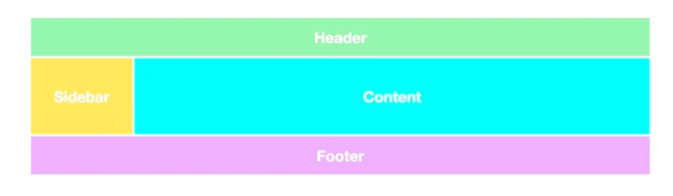
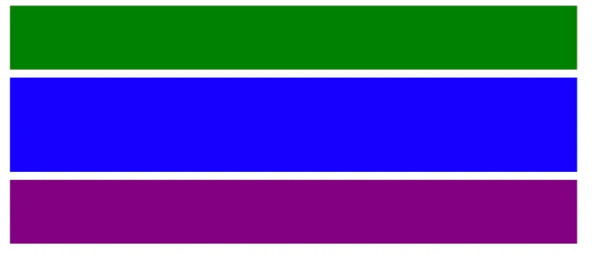
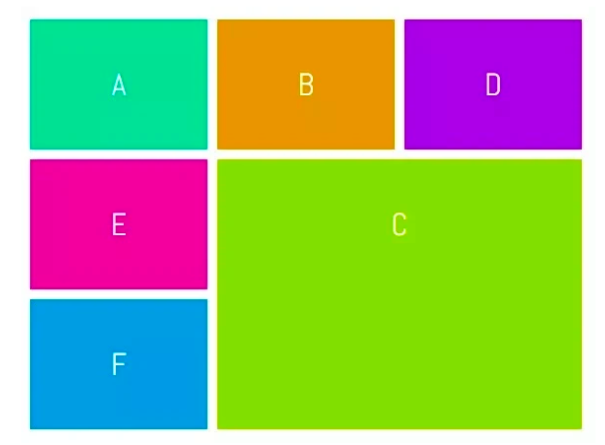
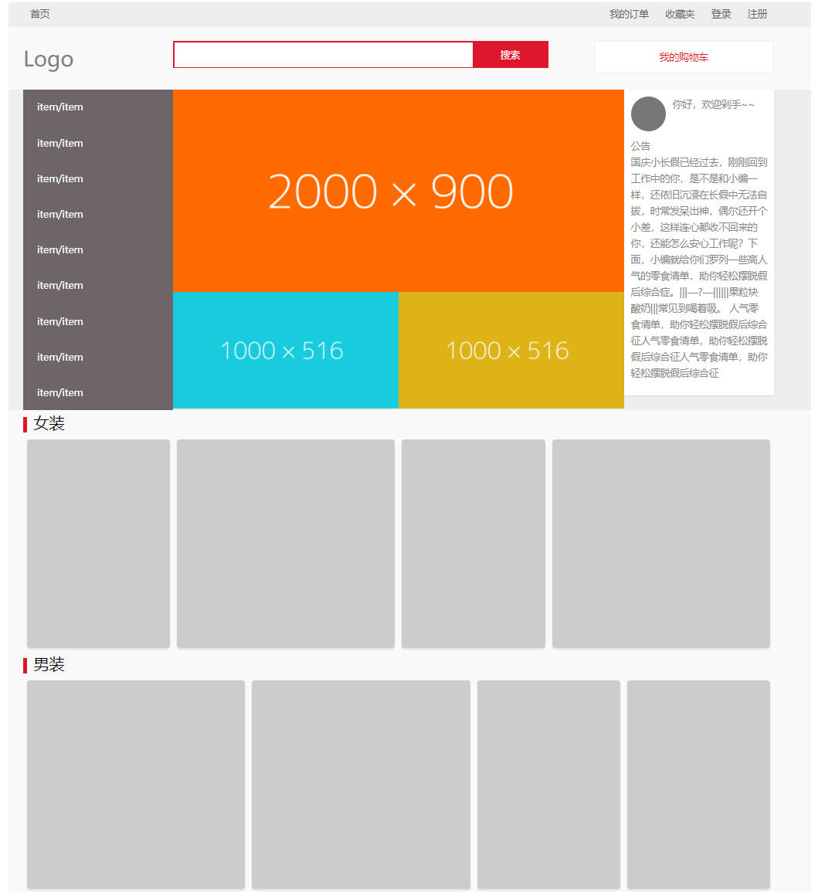

## 项目成立目的(Propose of this Repository)

做为一名小的前端开发程序员，我学习CSS的时候总是觉得自己会了，但是实际上只是脑子会了，动手写就傻了
As a Front-end Developer, I learn lots of CSS knowledge. However, When I try to use this part of knowledge in my project, I code like an fresh-man

所以我建立了这个练手项目，所有题目答案在Pages页面
Therefore, I build this repository to practice my skill, Each questions for Each project;

同时也会记录一些比较好看的CSS style用在自己以后的项目里面~
Also I will mark down some good looking CSS style for my future coding~

## CSS题目

#### Project1

#### Project2

#### Project3

#### Project4（待完成）

#### Project5

